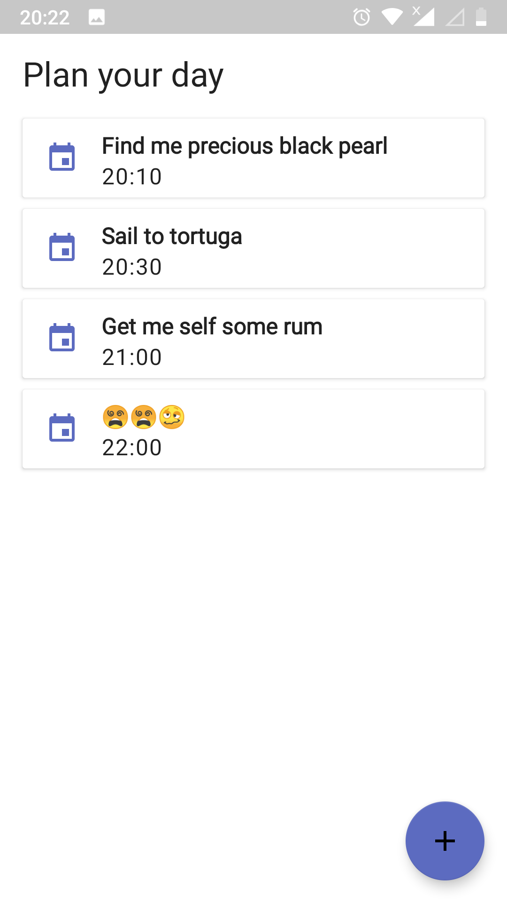
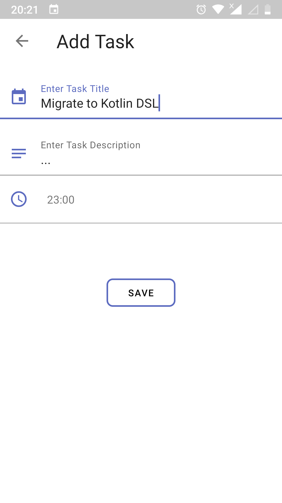
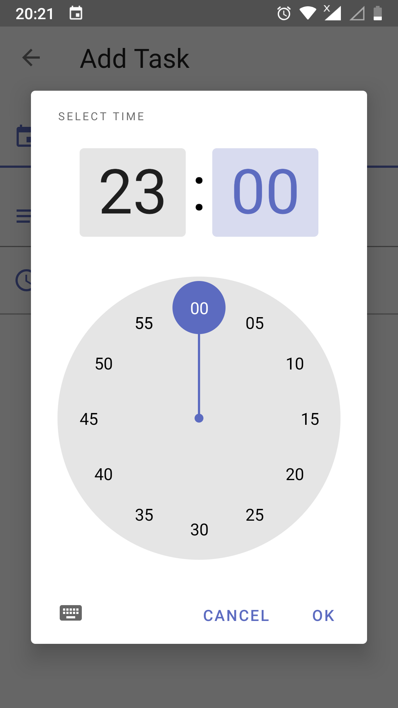
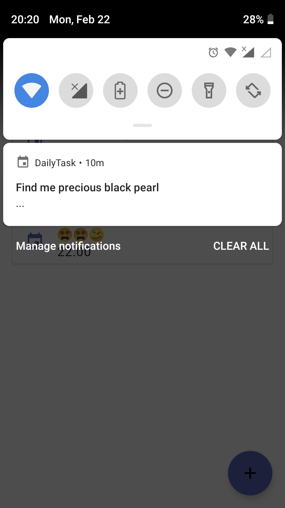

<h1 align="center">DailyTask</h1>

   

  
   Utility practice app for AAD Certification

# Screenshots
|||||
|:--:|:--:|:--:|:--:|

## Tech-stack

* Tech-stack
    * [Kotlin](https://kotlinlang.org/) - a cross-platform, statically typed, general-purpose programming language with type inference.
    * [Coroutines](https://kotlinlang.org/docs/reference/coroutines-overview.html) - perform background operations.
    * [Flow](https://kotlinlang.org/docs/reference/coroutines/flow.html) - handle the stream of data asynchronously that executes sequentially.
    * [Jetpack](https://developer.android.com/jetpack)
        * [Room](https://developer.android.com/topic/libraries/architecture/room) - a persistence library provides an abstraction layer over SQLite.
        * [LiveData](https://developer.android.com/topic/libraries/architecture/livedata) - is an observable data holder.
        * [Lifecycle](https://developer.android.com/topic/libraries/architecture/lifecycle) - perform action when lifecycle state changes.
        * [ViewModel](https://developer.android.com/topic/libraries/architecture/viewmodel) - store and manage UI-related data in a lifecycle conscious way.
        * [DataStore ](https://developer.android.com/topic/libraries/architecture/datastore) - store key-value pairs or typed objects.
        * [WorkManager](https://developer.android.com/topic/libraries/architecture/workmanager) - schedule deferrable, asynchronous tasks that are expected to run even if the app exits or the device restarts
    * [AlarmManager](https://developer.android.com/training/scheduling/alarms) - Schedule repeating alarms
    * [Timber](https://github.com/JakeWharton/timber) - a highly extensible android logger.

* Architecture
    * MVVM - Model View View Model
* Tests
    * [Unit Tests](https://en.wikipedia.org/wiki/Unit_testing) ([JUnit](https://junit.org/junit4/)) - a simple framework to write repeatable tests.
    * [Mockito](https://github.com/mockito/mockito)
    * [Truth](https://truth.dev/) - Fluent assertions for Java and Android
    * [Espresso](https://developer.android.com/training/testing/espresso) - write concise, beautiful, and reliable Android UI tests.

* CI/CD
    * Github Actions
